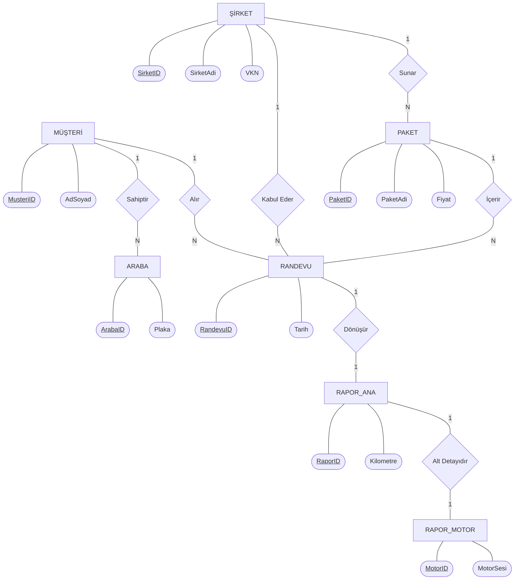

## Problem Tanımı
Günümüzde ikinci el araç alım satımında ve ekspertiz süreçlerinde çeşitli sıkıntılar yaşanmaktadır. Her ekspertiz firmasının kendine has bir randevu sistemi olması, kullanıcıların fiyat ve paket karşılaştırması yapmasını oldukça zorlaştırmaktadır.
Ek olarak, rapor sonuçlarının genellikle basılı bir kağıt olarak verilmesi; raporun kaybolması, deforme olması veya firmaların tasarımları taklit edilerek sahte (yalan) ekspertiz raporları üretilmesi gibi güvenlik sorunlarına yol açmaktadır.

Geliştirdiğimiz "OtoCheck" uygulaması ile bu sorunların önüne geçmeyi hedefledik. Sistemimiz, randevu alırken paket kapsamlarına göre daha hesaplı ve uygun olanı tercih edebilmenizi sağlamaktadır.
Ayrıca araç satın almak isteyen kullanıcılar, plaka veya şase numarası sorgusu ile geçmişteki ekspertiz raporlarını dijital ortamda güvenle inceleyebilmektedir. "Bu sorunlara nasıl bir çözüm üretebiliriz?" sorusundan yola çıkarak,
sahip olduğumuz Android Studio ve Kotlin bilgi birikimiyle bu mobil uygulamayı hayata geçirdik. Gerçek hayattaki ekspertiz sistemlerinde kontrol edilen çok fazla nokta ve devasa bir veri akışı bulunmaktadır. Projenin kapsamını yönetilebilir tutmak ve 
performans sorunlarını engellemek adına, uygulamamızda rapor verilerini belli başlı 5 ana kategori (Motor, Mekanik, Kaporta, Airbag, OBD) bazında modeledik.

## Yapılan Araştırmalar
* Uygulama geliştirme sürecinde bizi algoritmik olarak en çok zorlayan kısım "Randevu Alma" işlemi oldu. Aynı şirket, aynı tarih ve saat için mükerrer randevu alınması ihtimalini ortadan kaldırmamız gerekti.
Bu çakışma kontrolünün mantığını kurarken ve veritabanı ile haberleştirirken yapay zekadan destek aldık.
* Rapor yükleme aşaması teknik bir zorluktan ziyade, ekspertiz sürecindeki veri giriş noktalarının çokluğundan dolayı oldukça fazla vakit alan ve uğraştıran bir süreç oldu.
* Projede arayüz elemanlarını bağlamak ve ekranlar arası geçişi sağlamak için ViewBinding ve Navigation Component sistemlerini kullandık.
 Bu yapıların güncel kurulum ve tanımlama kodlarını doğrudan resmi dokümantasyon olan https://developer.android.com/ adresinden araştırarak entegre ettik.
* Şirket logosu yüklemek için galeriye erişim izni istememiz gerekiyordu. Uygulamamız geniş bir Android sürüm yelpazesini (Android 7 ve üstü) desteklediği için ve Android 11 öncesi/sonrası depolama izin sistemleri değiştiği için karmaşık izin kodları yazmamız gerekecekti.
Ancak yaptığımız araştırmalar (ve yapay zeka desteği) ile bunun çok daha modern ve kolay bir yolu olduğunu öğrendik: **Android Photo Picker "ActivityResultContracts.PickVisualMedia()" yapısı.
Bu yapı sayesinde kullanıcılardan tehlikeli depolama izinleri (READ_EXTERNAL_STORAGE) istemeden, sistemin kendi güvenli arayüzü üzerinden galeriden sadece istenen fotoğrafı seçtirmeyi başardık.

## Akış Şeması

## Yazılım Mimarisi
* Geliştirme Ortamı: Android Studio
* Yazılım Dil: Kotlin
* Veritabanı Yönetim Sistemi: Microsoft SQL Server (MSSQL)

## Veri Tabanı Diyagramı (Genişletilmiş Kavramsal Model)
Aşağıdaki diyagram, sistemin temel varlıkları arasındaki ilişkilerini ve Birincil Anahtarlarını ER diyagramı şeklinde göstermektedir:

## Genel Yapı
OtoCheck sistemi, sunucu (MSSQL Veritabanı) ve istemci (Android Mobil Uygulama) olmak üzere iki ana katmandan oluşan kapsamlı bir mimariye sahiptir.

* **Veritabanı Katmanı:** Sistem, 5N normalizasyon standartlarına tam uyumlu 13 adet ilişkisel tablodan oluşmaktadır. Kurumsal (Şirket) ve Bireysel (Müşteri) olarak iki ayrı kullanıcı tipini yönetir. Şehir/İlçe bazlı arama, dinamik paket filtreleme ve hiyerarşik ekspertiz raporu (Motor, Mekanik, Kaporta, Airbag, OBD vb.) kayıtları birbirine entegredir. Randevu statülerini ve çakışmaları kontrol eden otomatik tetikleyiciler (Trigger), şirketlerin istatistiklerini hesaplayan saklı yordamlar (Stored Procedure) ve veri bütünlüğünü sağlayan kısıtlamalar (Constraints) ile sistem tutarlı bir şekilde çalışır. Test süreçleri için tüm tablolara anlamlı
 test verileri (dummy data) girilmiştir.
* **İstemci (Mobil) Katmanı:** Android tarafında kullanıcı deneyimini artırmak için Navigation Component ve ViewBinding teknolojileri kullanılmıştır. Kullanıcılar sisteme giriş yaptıktan sonra araçlarını kaydedebilir, istedikleri lokasyondaki ekspertiz firmalarını ve paketlerini listeleyebilir, çakışma kontrollü randevu oluşturabilir ve geçmiş raporlarını dijital olarak detaylıca görüntüleyebilirler.

## Referanslar
1. Kocaeli Üniversitesi Bilişim Sistemleri Mühendisliği TBL331 Veritabanı Yönetim Sistemleri Ders Dokümanları
2. BTK Akademi & Atıl Samancıoğlu - "Kotlin ile İleri Seviye Android Mobil Uygulama Geliştirme" Eğitimleri
4. Android Developer Documentation (Photo Picker API, ViewBinding, Navigation Component)
5. Google Gemini AI (Veritabanı çakışma algoritmaları, Photo Picker çözümleri ve mantıksal tasarım optimizasyonu)
6. Mermaid.js Diagram Documentation
